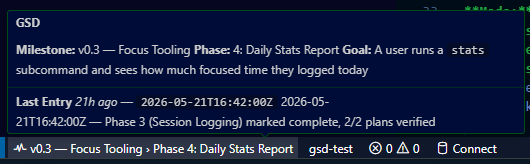
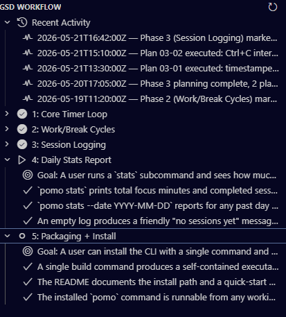

# GSD Status

Live GSD workflow state — milestone, phase, and recent activity — in your VS Code status bar and Activity Bar.

## Features

- **Status bar item** — always visible in the VS Code footer, showing your current GSD milestone and active phase in the format `$(icon) Milestone › Phase`. Click it to refresh.
- **Hover tooltip** — hover the status bar item to see the milestone name, the active phase name and goal, and the most recent `STATE.md` activity entry.
- **Command Palette commands** — four GSD commands available via `Ctrl+Shift+P`:
  - `GSD: Refresh` — manually re-read `.planning/` files and update the UI.
  - `GSD: Open Roadmap` — open `.planning/ROADMAP.md` in the editor.
  - `GSD: Open State` — open `.planning/STATE.md` in the editor.
  - `GSD: Refresh GSD tree` — refresh the Activity Bar side panel.
- **Activity Bar side panel** — a TreeView listing all phases from `ROADMAP.md` with the active phase highlighted, plus a Recent Activity section showing the latest `STATE.md` entries.
- **Welcome view** — when no GSD project is detected in the workspace, the side panel shows a "No GSD project found" welcome message.
- **Auto-refresh** — file watcher on `.planning/ROADMAP.md` and `.planning/STATE.md` keeps the UI current without polling; the status bar and tree update automatically when files change.

### Screenshots





## Requirements

- VS Code `^1.95.0` (stable)

## Installation

### From .vsix (local)

1. Download `gsd-status-0.1.0.vsix` (from the [releases page](https://github.com/DonutATX/gsd-extenstion/releases) or built from source).
2. Install via the command line:

   ```bash
   code --install-extension gsd-status-0.1.0.vsix
   ```

3. Or install via the Extensions panel:
   - Open the Extensions panel (`Ctrl+Shift+X`).
   - Click the `...` menu (top-right of the panel).
   - Select **Install from VSIX...** and choose the `.vsix` file.

## Configuration

The extension adds two settings under **GSD Status** (`Ctrl+,` → search "GSD"):

| Setting | Default | Minimum | Description |
|---------|---------|---------|-------------|
| `gsd.refreshIntervalSeconds` | `30` | `5` | Interval in seconds between automatic `.planning/` file refreshes. |
| `gsd.recentActivityCount` | `5` | `1` | Number of recent `STATE.md` entries to surface in the GSD side panel. |

## Build from Source

```bash
git clone https://github.com/DonutATX/gsd-extenstion
cd gsd-extenstion
npm install
npm run package
code --install-extension gsd-status-0.1.0.vsix
```

Requires Node.js `>=20` and VS Code `^1.95.0`.

## Known Limitations

- **Read-only** — the extension observes `.planning/` files only and never writes to them.
- **Single-workspace scope** — only the first workspace folder is inspected for a `.planning/` directory.
